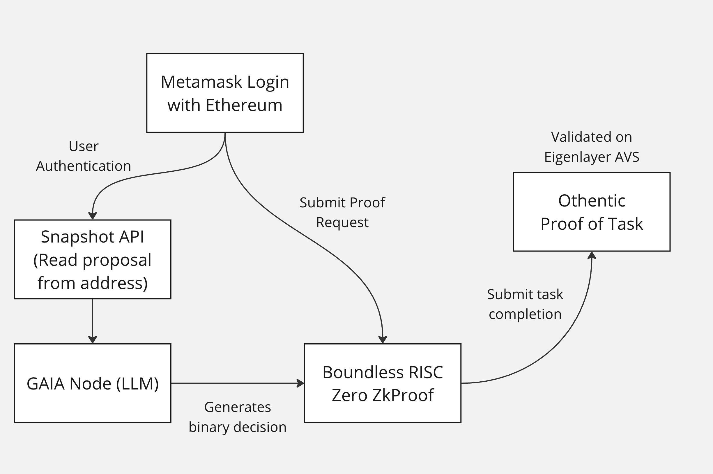

# Transparent DAO Decision-Making Platform



## Overview

The Transparent DAO Decision-Making Platform revolutionizes decentralized governance by combining advanced AI insights with cutting-edge cryptographic verification. Designed for DAOs that demand transparency, security, and informed decision-making, this platform empowers community members to evaluate proposals efficiently and confidently. Our solution not only streamlines governance processes but also lays the groundwork for a new era of decentralized, trust-enhanced decision-making.

## Key Features

- **Seamless Authentication:**  
  Securely log in using your Metamask wallet to ensure a decentralized, user-first experience.

- **Instant Proposal Retrieval:**  
  Quickly fetch proposal details from the Snapshot API by simply entering a proposal ID.

- **AI-Powered Analysis (GAIA):**  
  Our AI agent, GAIA, evaluates each proposal and delivers a clear decision recommendation accompanied by an in-depth rationale. This feature helps users to identify potential issues and make informed choices without the need to parse through extensive documentation.

- **Immutable Verification with zk-Proofs:**  
  Decisions are locked in through zk-proof verification via Boundless by RISC Zero, ensuring that once a decision is made, it remains unalterable.

- **Robust Task Authentication:**  
  Verification tasks are confirmed via the Othentic Stack’s Proof of Task, further cementing the integrity and transparency of every step in the decision-making process.

## How It Works

1. **User Login:**  
   - Authenticate securely using your Metamask wallet.

2. **Proposal Input:**  
   - Enter a proposal ID to retrieve comprehensive proposal details from the Snapshot API.

3. **AI Analysis:**  
   - GAIA processes the proposal and returns a decision along with a detailed explanation of its reasoning, highlighting any potential red flags.

4. **zk-Proof Verification:**  
   - The AI-generated decision is sent for immutable verification via zk-proofs using Boundless by RISC Zero. The user's wallet funds the verification task, ensuring a secure and decentralized process.

5. **Proof of Task Verification:**  
   - Once a Prover on Boundless completes the verification, the task is forwarded to the Othentic Stack for final authentication via Proof of Task, ensuring that every aspect of the process is both secure and transparent.

## Technology Stack

- **Frontend:**  
  Developed with Next.js, Shadcn, and Tailwind CSS for a modern, responsive, and user-friendly interface.

- **Authentication:**  
  Metamask wallet integration provides secure, decentralized login.

- **Data Integration:**  
  Utilizes the Snapshot API for real-time proposal data retrieval.

- **AI Analysis:**  
  Powered by GAIA, our dedicated AI agent, which provides prompt and reliable decision insights.

- **Verification:**  
  - **zk-Proofs:** Implemented via Boundless by RISC Zero to ensure decision immutability.
  - **Proof of Task:** Leveraged via the Othentic Stack to authenticate the integrity of the verification process.

## Transformative Impact

This platform has the potential to fundamentally reshape DAO governance and the broader decentralized ecosystem by:

- **Empowering Every Member:**  
  By demystifying the proposal evaluation process, the platform democratizes decision-making. Members with limited technical expertise or time can now make well-informed decisions, boosting overall community engagement and participation.

- **Enhancing Transparency and Trust:**  
  With every decision cryptographically verified, stakeholders can trust that the entire process is both fair and tamper-proof. This builds confidence in the governance model and minimizes the risk of manipulation.

- **Setting a New Standard for DAO Governance:**  
  The integration of AI and cryptographic verification sets a new benchmark for security and transparency. As more DAOs adopt these practices, the entire ecosystem will move towards more robust and reliable governance models.

- **Scaling with Innovation:**  
  Our solution is designed to integrate seamlessly with existing DAO infrastructures, allowing for automated processing of proposals. This scalability ensures that as DAOs grow and evolve, the platform remains a vital tool in maintaining order and trust.

- **Fostering Industry-Wide Change:**  
  By combining the best of AI analysis with immutable verification, this platform is poised to become an industry standard for decentralized governance. Its influence could extend beyond DAOs, inspiring new protocols and tools across the blockchain landscape that prioritize transparency and informed decision-making.

## Getting Started

To set up and run the project locally, follow these steps:

1. **Clone the Repository:**
   ```bash
   git clone https://github.com/yourusername/dao-decision-platform.git
   cd frontend
   ```

2. **Install Dependencies:**
   ```bash
   pnpm install
   ```

3. **Fill in the .env.local file:**

4. **Run the Development Server:**
   ```bash
   pnpm run dev
   ```

5. **Access the Application:**
   Open your browser and navigate to `http://localhost:3000` to view the application.

## Contributing
This project is open to contributions. Please feel free to submit a PR. 

## License
This project is licensed under the MIT License. See the LICENSE file for details.

### This project was built for the Eigen Games at EthDenver 2025 - the largest university innovation competition in the history of Web3.